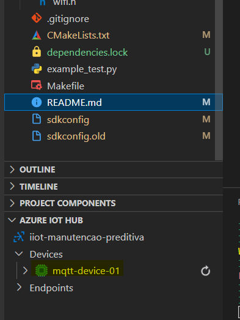

# How to connect esp32 on azure iot hub using mqtt protocol

## Configure WiFi

* WiFi SSID          [main](main/main.c)             
* WiFi Password      [main](main/main.c)             
* WiFi authmode      [wifi](main/wifi.c)(default: WPA2_PSK,line 100)

## Configure Azure Enviroment

Firstly create an [Azure IoT Hub](https://learn.microsoft.com/pt-br/azure/iot-hub/iot-hub-create-through-portal), create at least one device to copy it device id

at main modify following macros

* IOTHUB_NAME: your iot hub name, you can visualize it on URL {iot-hub-name}.azure-devices.net

* IOTHUB_DEVID: device id

* IOTHUB_KEY: SaS Token, incluing all generated

## How generate SaS Token using vscode plugin

open vscode and install azure account and azure iot hub extensions

press Crtl + shift + P and tip: azure: Sign in to azure cloud and log in on azure using your account

after logged, find Azure IoT Hub tab at file explorer, right click on your device and select the option: "Generate SaS Token for Device"

